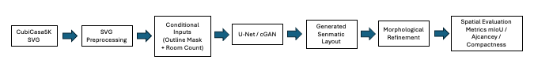
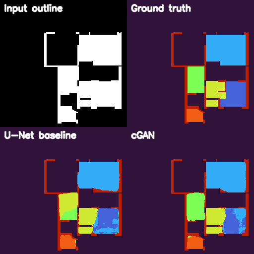

# Conditional Floor Plan Generation (CubiCasa5K)

This repository contains the implementation for an MSc Data Science
project on **conditional semantic floor plan generation** using the
CubiCasa5K dataset.

The objective is to generate structured 2D residential layouts from
simple inputs (building outline + room count), evaluate them using
spatial metrics, and improve geometric quality through lightweight
refinement.

------------------------------------------------------------------------

## Research Context

This repository supports an MSc Data Science dissertation focused on conditional semantic floor plan generation using lightweight deep learning and refinement strategies under constrained hardware environments.

------------------------------------------------------------------------

## System Overview

The project framework combines conditional semantic segmentation, adversarial learning, and lightweight refinement for structured floor plan generation.



------------------------------------------------------------------------

## Key Features

- SVG-based CubiCasa5K preprocessing pipeline
- Conditional U-Net semantic layout generation
- Conditional GAN (cGAN)-based adversarial refinement
- Lightweight morphology-based post-processing
- Spatial evaluation using semantic and geometric metrics
- Qualitative comparison visualisation framework
- Training and evaluation on Apple M1 hardware using PyTorch MPS

------------------------------------------------------------------------

## Repository Structure

```text
conditional-floorplan-generation/
│
├── data/
│   ├── cubicasa5k/
│   ├── processed_npz/
│   └── processed_npz_clean/
│
├── outputs/
│   ├── checkpoints/
│   ├── comparison_samples/
│   └── metrics/
│
├── scripts/
│   ├── evaluate_metrics.py
│   ├── evaluate_cgan.py
│   ├── visualize_comparison.py
│   ├── refine_morphology.py
│   └── refine_hillclimb.py
│
├── src/
│   ├── preprocess/
│   ├── models/
│   ├── training/
│   └── evaluation/
│
├── train_unet.py
├── train_cgan.py
├── README.md
└── EXPERIMENTS.md
```
------------------------------------------------------------------------

## Dataset

This project uses the **CubiCasa5K** dataset:

*CubiCasa5K: A Dataset and an Improved Multi-Task Model for Floorplan
Image Analysis*

Download links: 
- Zenodo: https://zenodo.org/record/2613548 
- GitHub: https://github.com/CubiCasa/CubiCasa5k

After downloading, place the dataset in:

data/cubicasa5k/<cat_name>/<sample_id>/model.svg

Example:

data/cubicasa5k/high_quality_architectural/10000/model.svg

The dataset is **not included** in this repository due to size
constraints.

------------------------------------------------------------------------

## Environment

-   Python 3.9
-   Apple MacBook Pro (M1)
-   PyTorch with Metal Performance Shaders (MPS)

Install dependencies:

```bash
pip install -r requirements.txt
```

------------------------------------------------------------------------

## Pipeline Overview

The complete pipeline consists of:

1.  SVG preprocessing
2.  Dataset filtering
3.  Conditional UNet training
4.  Spatial evaluation
5.  Post-generation refinement

------------------------------------------------------------------------

## Step 1: Preprocess CubiCasa5K (SVG → NPZ)

```bash
python -m src.preprocess.preprocess_cubicasa --data_root data/cubicasa5k
--out_dir data/processed_npz
```

Optional:

```bash
python -m src.preprocess.preprocess_cubicasa --data_root data/cubicasa5k
--out_dir data/processed_npz --max_samples 2000
```
------------------------------------------------------------------------

## Step 2: Inspect Generated NPZ Files
```bash
python scripts/inspect_npz.py
```

------------------------------------------------------------------------

## Step 3: Filter Dataset (≥ 3 rooms)
```bash
python scripts/filter_dataset.py
```

Filtered output:

```bash
data/processed_npz_clean/
```

------------------------------------------------------------------------

## Step 4: Compute Maximum Room Count

```bash
python scripts/compute_max_count.py
```

------------------------------------------------------------------------

## Step 5: Train Conditional UNet Baseline

```bash
python train_unet.py
```

Model checkpoints:

outputs/checkpoints/

------------------------------------------------------------------------

## Step 6: Evaluate Baseline Metrics

```bash
python -m scripts.evaluate_metrics
```

Results:

outputs/metrics_baseline.csv

------------------------------------------------------------------------

## Step 7: Train Conditional GAN (cGAN)

```bash
python train_cgan.py
```

Output:

outputs/checkpoints/cgan_unet_patchgan_best.pt

------------------------------------------------------------------------

## Step 8: Evaluate cGAN Metrics

```bash
python -m scripts.evaluate_cgan
```

Output:

outputs/metrics_cgan.csv

------------------------------------------------------------------------

## Step 9: Generate Qualitative Comparisons

```bash
python -m scripts.visualize_comparison
```

Output:

outputs/comparison_samples/

Each comparison image contains:
- input outline mask,
- ground-truth semantic layout,
- U-Net baseline prediction,
- cGAN prediction.

------------------------------------------------------------------------

## Step 10: Refinement

### Morphological Refinement (Adopted)

```bash
python -m scripts.refine_morphology
```

Output:

outputs/metrics_refined_morph.csv

### Hill-Climbing Refinement (Experimental)

```bash
python -m scripts.refine_hillclimb
```

### Spatial Evaluation Metrics

The framework evaluates generated layouts using both semantic and geometric metrics:

* Mean Intersection over Union (mIoU)
* Adjacency similarity (F1)
* Geometric compactness

These metrics are used to assess:

* semantic prediction accuracy,
* relational room structure,
* and geometric layout quality.
------------------------------------------------------------------------

## Current Experimental Results

| Model | mIoU | Adjacency F1 | Compactness |
|---|---:|---:|---:|
| U-Net Baseline | 0.321 | 0.179 | 0.469 |
| U-Net + Morphology | 0.327 | 0.183 | 0.611 |
| U-Net + Hill-Climb | 0.256 | 0.181 | 0.528 |
| cGAN | 0.546 | 0.238 | 0.547 |
| cGAN + Morphology | 0.567 | 0.250 | 0.660 |
| cGAN + Hill-Climb | 0.443 | 0.228 | 0.565 |

Results obtained on a filtered subset of 1966 floor plans derived from the CubiCasa5K dataset.

## Qualitative Comparison

Example comparison between:
- input outline mask,
- ground-truth layout,
- U-Net prediction,
- and cGAN prediction.



For detailed experiment logs, training observations, and refinement analysis, see:

`EXPERIMENTS.md`

------------------------------------------------------------------------

## Current Status

- SVG preprocessing implemented
- Dataset filtering implemented
- Conditional U-Net baseline implemented
- Conditional GAN (cGAN) implemented
- Spatial evaluation metrics implemented
- Morphological refinement implemented
- Hill-climbing refinement implemented
- Comparative evaluation completed
- Qualitative comparison generation implemented

------------------------------------------------------------------------

## Future Work

Planned future improvements include:
- larger-scale CubiCasa5K training,
- improved conditioning mechanisms,
- graph-based spatial reasoning,
- diffusion-based generation approaches,
- and stronger architectural constraint modelling.

------------------------------------------------------------------------

## License

This repository is intended for academic research purposes.
